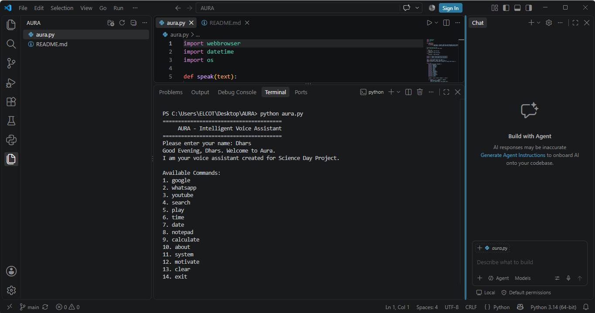

# AURA – Intelligent Voice Assistant 🤖


AURA is a Python-based desktop voice assistant developed as a Science Day project.

It provides a simple command-based interface with voice output and can perform useful web, system, and utility operations.

## 🚀 Features

- 👋 Time-based greeting
- 🗣️ Voice output using Windows Speech Synthesizer
- 🌐 Open Google
- 💬 Open WhatsApp
- ▶️ Open YouTube
- 🔍 Perform web searches
- 🎵 Play content
- 🕐 Display current time
- 📅 Display current date
- 📝 Open Notepad
- 🧮 Open Calculator
- 💻 Display system information
- 💡 Provide motivational messages
- 🧹 Clear the terminal
- 🚪 Exit the assistant

## 🛠️ Technologies Used

- Python
- `webbrowser`
- `datetime`
- `os`
- Windows PowerShell Speech Synthesizer

## 📂 Project Structure

```text
AURA/
│
├── aura.py
└── README.md
